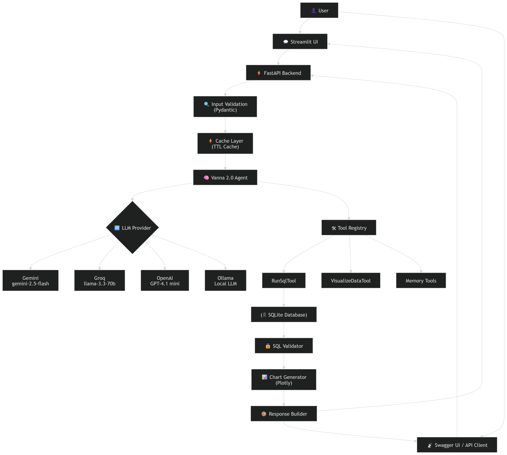

# 🏥 NL2SQL Clinic Intelligence System

> **AI-powered Natural Language → SQL system** built using **Vanna 2.0 · FastAPI · Multi-LLM · Streamlit**

[](https://python.org)
[](https://fastapi.tiangolo.com)
[](https://vanna.ai)
[](https://streamlit.io)
[](https://sqlite.org)

---

## 📌 Overview

A **production-ready NL2SQL system** that lets users ask plain-English questions about a clinic management database and receive instant, accurate answers — complete with SQL, results, and auto-generated charts. No SQL knowledge required.

```
User → "Top 5 patients by spending"
              ↓
     FastAPI Backend (Rate Limiting + Caching)
              ↓
     Vanna 2.0 Agent (Multi-LLM: Gemini / Groq / Ollama)
              ↓
     SQL Safety Validator (SELECT-only guard)
              ↓
     SQLite Execution (clinic.db)
              ↓
     Response: message + sql_query + rows + Plotly chart
```

---

## 🚀 Key Features

| Feature | Status |
|---------|--------|
| Natural Language → SQL (Vanna 2.0 Agent) | ✅ |
| Multi-LLM Support (Gemini, Groq, OpenAI, Ollama) | ✅ |
| Agent Memory (15 seeded Q&A pairs) | ✅ |
| SQL Safety Validation (SELECT-only) | ✅ |
| Auto Plotly Chart Generation | ✅ |
| FastAPI with Rate Limiting (10 req/min) | ✅ |
| Query Result Caching (5-min TTL) | ✅ |
| Streamlit Chatbot UI with quick-questions | ✅ |
| Custom Swagger UI (dark branded theme) | ✅ |
| Structured Logging (loguru) | ✅ |
| Input Validation (Pydantic) | ✅ |

---

## 🧠🏗️ Hole Multi-LLM Architecture


Automatically Switch of  LLM provider if daily quota limit exceed or any issue occur in llm provider and  no code changes needed.

| Provider | Model | Type | `.env` value |
|----------|-------|------|--------------|
| **Google Gemini** ⭐ | gemini-2.5-flash | Free (AI Studio) | `gemini` |
| **Groq** | llama-3.3-70b-versatile | Free tier | `groq` |
| **Ollama** | llama3 / mistral | Local / Free | `ollama` |
| **OpenAI** | gpt-4.1-mini | Paid | `openai` |


---


## 🏗️ Architecture Overview

```
┌─────────────────────────────────────────────────────────┐
│                     Client Layer                        │
│      Streamlit UI  ──────────  Swagger / Any HTTP       │
└────────────────────────┬────────────────────────────────┘
                         │ HTTP
┌────────────────────────▼────────────────────────────────┐
│                  FastAPI Backend                        │
│                                                         │
│   Rate Limiter → /chat  /health                         │
│        ↓                                                │
│   Pydantic Input Validation                             │
│        ↓                                                │
│   TTLCache (5-min query cache)                          │
│        ↓                                                │
│   Vanna 2.0 Agent                                       │
│     ├─ LLM Service  (Gemini / Groq / Ollama)            │
│     ├─ DemoAgentMemory  (15 seeded Q&A pairs)           │
│     └─ RunSqlTool  (SQLite executor)                    │
│        ↓                                                │
│   SQL Validator  (SELECT-only safety guard)             │
│        ↓                                                │
│   Chart Service  (Plotly auto-generation)               │
│        ↓                                                │
│   Structured JSON Response                              │
└────────────────────────┬────────────────────────────────┘
                         │
┌────────────────────────▼────────────────────────────────┐
│              SQLite  —  clinic.db                       │
│  patients · doctors · appointments · treatments ·       │
│  invoices   (1,365 total records)                       │
└─────────────────────────────────────────────────────────┘
```
---


## 🖼️ UI Preview

### 💬 Streamlit Chat Interface


- Chat-style interface with message history
- Clickable quick-questions sidebar (15 pre-loaded)
- SQL syntax highlighting on expand
- Auto-rendered Plotly charts inline
- Cache ⚡ and timing ⏱ badges per response

### 📡 FastAPI Swagger UI (Custom Dark Theme)


- Fully branded dark-theme Swagger UI at `/docs`
- ReDoc at `/redoc`
- Try-it-out on every endpoint
- `/chat` and `/health` fully documented

---

## 🗂️ Project Structure

```
nl2sql-vanna-ai/
│
├── app/
│   ├── core/
│   │   ├── config.py          # Settings via pydantic-settings + .env
│   │   ├── database.py        # SQLite connection helper
│   │   ├── logger.py          # Structured logging (loguru)
│   │   └── vanna_setup.py     # Vanna 2.0 Agent init (multi-LLM)
│   │
│   ├── api/
│   │   ├── models.py          # Pydantic request/response schemas
│   │   └── routes.py          # /chat and /health route handlers
│   │
│   └── services/
│       ├── sql_validator.py   # SQL safety validation layer
│       └── chart_service.py   # Plotly auto chart generation
│
├── app/main.py                # FastAPI app (Swagger + middleware)
├── streamlit_app.py           # Streamlit chatbot frontend
├── main.py                    # Root entry point (uvicorn main:app)
├── setup_database.py          # Creates schema + 1,365 dummy records
├── seed_memory.py             # Seeds 15 Q&A pairs into agent memory
├── vanna_setup.py             # Root-level alias (assignment requirement)
├── requirements.txt           # All dependencies
├── .env.example               # Config template (no secrets)
├── README.md
└── RESULTS.md                 # 20-question test results
```

---

## 📦 Dataset

| Table | Records | Details |
|-------|---------|---------|
| `patients` | 200 | Names, cities, DOB, gender — 10 cities |
| `doctors` | 15 | 5 specializations, 3 per specialty |
| `appointments` | 500 | Last 12 months, varied statuses |
| `treatments` | ~350 | Linked to completed appointments |
| `invoices` | 300 | Mix of Paid / Pending / Overdue |

---

## ⚙️ Setup Instructions

### Step 1 — Clone the repository

```bash
git clone https://github.com/Nihal108-bi/nl2sql-clinic-ai.git
cd nl2sql-clinic-ai
```

### Step 2 — Create a virtual environment

```bash
# Windows
python -m venv venv
venv\Scripts\activate

# macOS / Linux
python -m venv venv
source venv/bin/activate
```

### Step 3 — Install dependencies

```bash
pip install -r requirements.txt
```

### Step 4 — Configure environment variables

```bash
# Windows
copy .env.example .env

# macOS / Linux
cp .env.example .env
```

Open `.env` and set your API key:

```env
LLM_PROVIDER=gemini
GOOGLE_API_KEY=your_key_here
```

Get a free Gemini key at: https://aistudio.google.com/apikey

### Step 5 — Create the database

```bash
python setup_database.py
```

Expected output:
```
──────────────────────────────────────────────────
  clinic.db created successfully!
──────────────────────────────────────────────────
  Patients     : 200
  Doctors      : 15
  Appointments : 500
  Treatments   : 350
  Invoices     : 300
──────────────────────────────────────────────────
```

### Step 6 — Seed agent memory

```bash
python seed_memory.py
```

This loads 15 high-quality question → SQL examples into the agent's memory, significantly improving accuracy from the first query.

### Step 7 — Start the API server

```bash
uvicorn main:app --port 8000
```

API is now live at: http://localhost:8000

### Step 8 — Start the Streamlit frontend (optional)

Open a **second terminal** and run:

```bash
streamlit run streamlit_app.py
```

Chatbot is now live at: http://localhost:8501

---

## ▶️ One-Command Run (Assignment Requirement)

```bash
pip install -r requirements.txt && python setup_database.py && python seed_memory.py && uvicorn main:app --port 8000
```

---

## 📡 API Documentation

### Interactive Docs

| Interface | URL |
|-----------|-----|
| Custom Swagger UI | http://localhost:8000/docs |
| ReDoc | http://localhost:8000/redoc |
| OpenAPI JSON | http://localhost:8000/openapi.json |

### `POST /chat`

**Request:**
```json
{
  "question": "Show me the top 5 patients by total spending"
}
```

**Response:**
```json
{
  "message": "Here are the top 5 patients by total spending...",
  "sql_query": "SELECT p.first_name, p.last_name, SUM(i.total_amount) AS total_spending FROM patients p JOIN invoices i ON p.id = i.patient_id GROUP BY p.id ORDER BY total_spending DESC LIMIT 5",
  "columns": ["first_name", "last_name", "total_spending"],
  "rows": [["John", "Smith", 14500.00], ["Jane", "Doe", 12300.50]],
  "row_count": 5,
  "chart": { "data": [...], "layout": {...} },
  "chart_type": "bar",
  "cached": false,
  "error": null
}
```

**cURL example:**
```bash
curl -X POST http://localhost:8000/chat \
  -H "Content-Type: application/json" \
  -d '{"question": "How many patients do we have?"}'
```

### `GET /health`

**Response:**
```json
{
  "status": "ok",
  "database": "connected",
  "agent_memory_items": 15,
  "llm_provider": "gemini"
}
```

---

## 🔒 SQL Validation Rules

All AI-generated SQL is validated before execution:

| Rule | Details |
|------|---------|
| SELECT only | Rejects INSERT, UPDATE, DELETE, DROP, ALTER, CREATE, TRUNCATE |
| No dangerous keywords | Rejects EXEC, XP_, SP_, GRANT, REVOKE, SHUTDOWN, ATTACH |
| No system tables | Rejects sqlite_master, sqlite_sequence, etc. |

---

## 🧪 Test Coverage

20 test questions evaluated — see `RESULTS.md` for full details.

**Overall Score: 18 / 20**

| Category | Result |
|----------|--------|
| Simple COUNT / SUM queries | ✅ All pass |
| JOIN + GROUP BY queries | ✅ All pass |
| Date-based filtering | ✅ Most pass |
| Complex multi-table JOINs | ✅ Pass after memory seeding |
| Revenue trend (time series) | ❌ 1 failure — LLM date ambiguity |

---

## 💡 Why This Project Stands Out

- **Multi-LLM architecture** — swap providers via one env variable
- **Memory-augmented agent** — improves accuracy over time
- **Full validation layer** — no unsafe SQL ever executes
- **End-to-end system** — API + chatbot UI + database + charts
- **Production patterns** — rate limiting, caching, structured logging
- **Honest documentation** — real test results, real failures explained

---

## 🧑‍💻 Author

**Nihal Jaiswal**  
AI/ML Engineer · NLP · GenAI · FastAPI

---

## 📝 Resume Line

> *"Built production-ready NL2SQL system using Vanna 2.0, FastAPI, and Google Gemini with multi-LLM architecture, memory-augmented query generation, automated Plotly visualisation, rate limiting, query caching, SQL safety validation, and a Streamlit chatbot frontend."*
