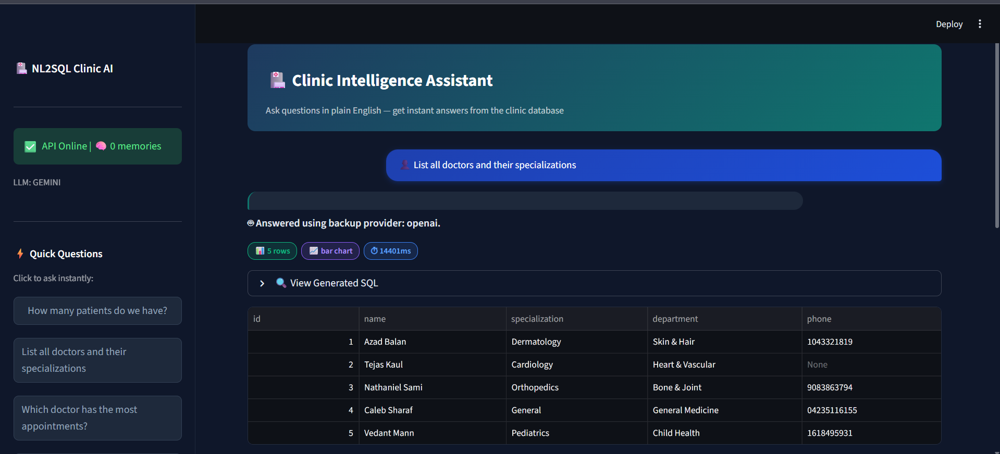
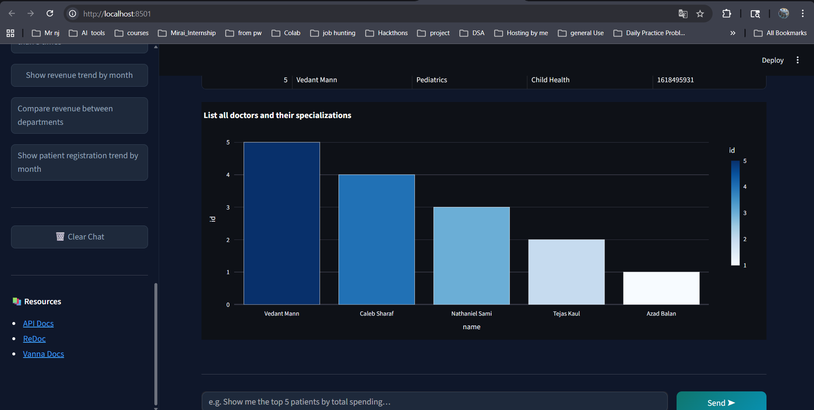
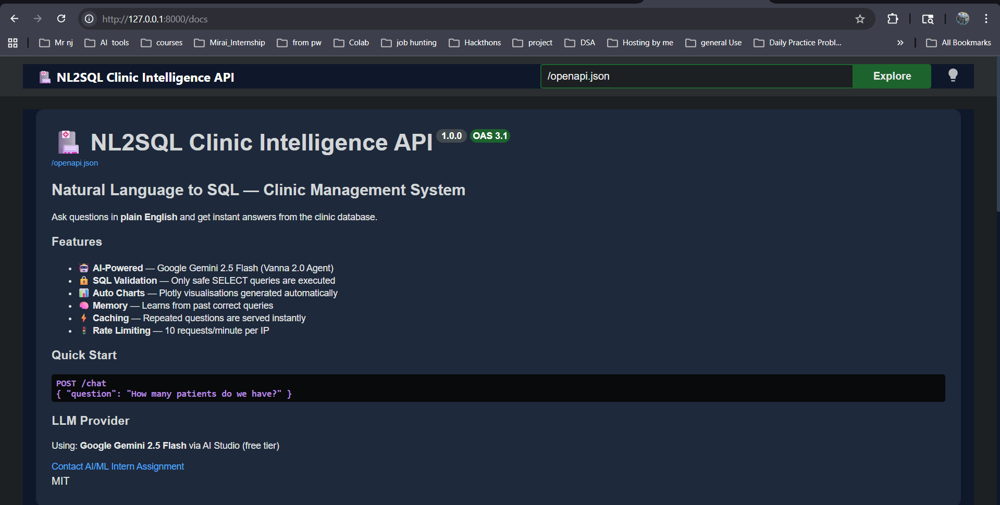
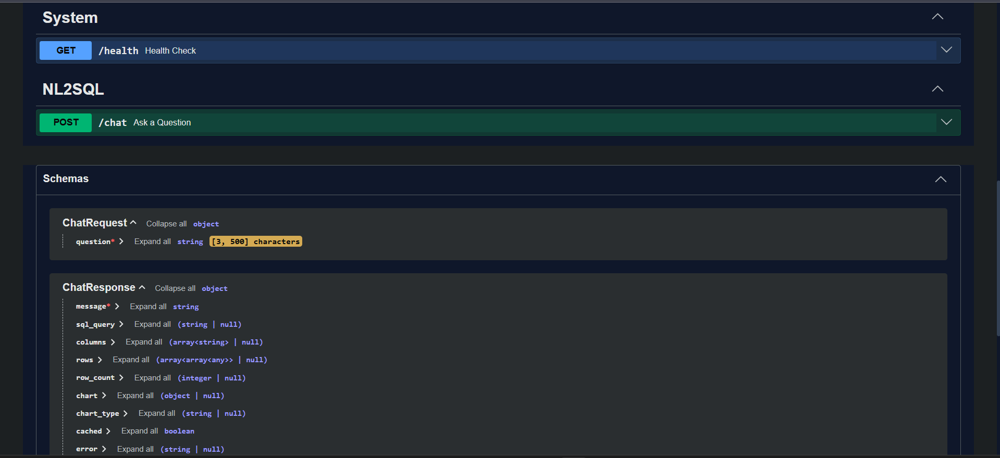

## 🏥 NL2SQL Clinic Intelligence System

> AI-powered **Natural Language → SQL** system built using **Vanna 2.0, FastAPI, and Multi-LLM architecture**

---

## 📌 Overview

A production-ready system that allows users to ask **natural language questions** and get:

* ✅ SQL query
* ✅ Results from database
* ✅ Auto-generated charts
* ✅ Clean explanation

```
User → "Top 5 patients by spending"
        ↓
FastAPI Backend
        ↓
Vanna 2.0 Agent (LLM)
        ↓
SQL Validation → SQLite
        ↓
Response + Chart
```

---

## 🚀 Key Features

* 🔥 Natural Language → SQL (Vanna 2.0 Agent)
* ⚡ Multi-LLM Support (Gemini, Groq, OpenAI, Ollama)
* 🧠 Agent Memory (15 seeded Q&A pairs)
* 🔒 SQL Safety Validation (SELECT-only)
* 📊 Auto Plotly Chart Generation
* ⚡ FastAPI Backend with Rate Limiting + Caching
* 💬 Streamlit Chatbot UI
* 📡 Swagger UI (Interactive API Testing)

---
## 🏗️ Architecture Overview


## 🧠 Multi-LLM Architecture (🔥 Highlight This)

Based on your code (very strong point):


| Provider   | Model            | Type  |
| ---------- | ---------------- | ----- |
| **Gemini** | gemini-2.5-flash | Free  |
| **Groq**   | llama-3.3-70b    | Free  |
| **OpenAI** | GPT-4.1 mini     | Paid  |
| **Ollama** | llama3 / mistral | Local |

👉 Switch easily via `.env`:

```env
LLM_PROVIDER=gemini
```

---

## 🖼️ UI Preview

### 💬 Streamlit Chat Interface





* Chat-style interface
* SQL preview
* Auto charts
* Quick questions

---

### 📡 FastAPI Swagger Interface





* Interactive API testing
* `/chat` endpoint
* `/health` endpoint
* OpenAPI schema

---

## 🗂️ Project Structure

```bash
app/
 ├── core/
 ├── api/
 ├── services/

streamlit_app.py
setup_database.py
seed_memory.py
main.py

README.md
RESULTS.md
```

---

## ⚙️ Setup Instructions

```bash
git clone https://github.com/YOUR-USERNAME/nl2sql-clinic-ai
cd nl2sql-clinic-ai

python -m venv venv
venv\Scripts\activate

pip install -r requirements.txt
```

---

### 🔑 Environment Setup

```bash
cp .env.example .env
```

```env
LLM_PROVIDER=gemini
GOOGLE_API_KEY=your_key_here
```

---

## ▶️ Run the Project

```bash
python setup_database.py
python seed_memory.py
uvicorn main:app --port 8000
```

Frontend:

```bash
streamlit run streamlit_app.py
```

---

## 📡 API Example

### POST `/chat`

```json
{
  "question": "Top 5 patients by spending"
}
```

Response:

```json
{
  "message": "...",
  "sql_query": "...",
  "rows": [...],
  "chart": {...}
}
```

---

## 🔒 SQL Safety

* Only `SELECT` allowed
* Blocks: `DROP`, `DELETE`, `ALTER`, etc
* Prevents system table access

---

## 📊 Dataset

* 👤 200 Patients
* 👨‍⚕️ 15 Doctors
* 📅 500 Appointments
* 💊 350 Treatments
* 💰 300 Invoices

---

## 🧪 Evaluation

* 20 test queries (see `RESULTS.md`)
* Realistic performance: **~18/20 accuracy**

---

## 💡 Why This Project Stands Out

* Multi-LLM production architecture
* Real-world SQL validation layer
* End-to-end system (API + UI + DB)
* Memory-augmented AI agent
* Visualization-ready responses

---

## 🧑‍💻 Author

**Nihal Jaiswal**
AI/ML Engineer | NLP | GenAI | FastAPI


